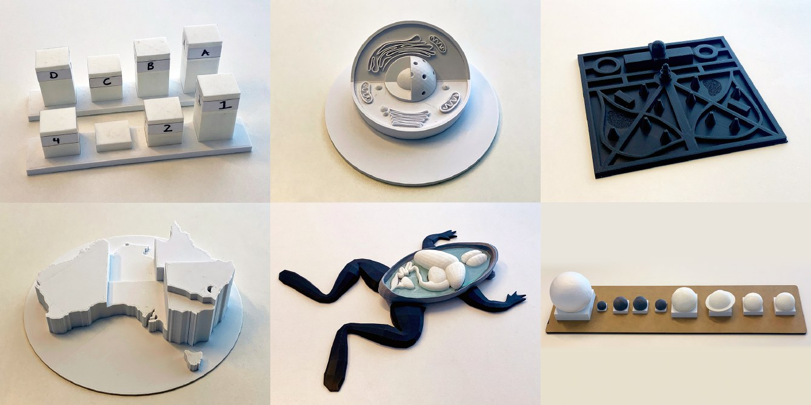

3D printed models can give people who are blind or have low vision (BLV) access to graphical information such as maps, educational materials and museum exhibits. On their own, though, they carry only limited detail and context, and many interactive models rely on passive audio labels. My PhD, *Creating Multimodal Interactive 3D Printed Models with People who are Blind or have Low Vision*, supervised by Associate Professor Matthew Butler and Professor Kim Marriott, explored interactive 3D printed models (I3Ms) that support independent exploration and knowledge discovery.

## How people want to interact

A Wizard-of-Oz study uncovered the interaction techniques BLV people want to use with I3Ms, and their attitudes towards different levels of model agency. These findings shaped a prototype of the solar system. A second study with that model revealed a hierarchy of interaction: BLV users preferred tactile exploration first, then touch gestures to trigger audio labels, and then natural language to fill knowledge gaps and confirm understanding.

## Co-designing a conversational Solar System

We co-designed a multimodal model of the Solar System with nine blind people and evaluated it with seven more. The model combines a conversational interface with touch and haptic vibration. From this we drew design recommendations centred on blind users' desire for independence and control, customisation, comfort, and use of prior experience.

## Models that come to life

Research with sighted people shows that giving machines human-like behaviours can make them seem more lifelike, which can increase engagement and trust. In the first exploration of embodied I3Ms, a controlled study with 12 BLV participants found that design factors such as haptic vibration and embodied, personified voices increased the sense of liveliness, embodiment and engagement, but had a mixed impact on trust. This work received a Best Paper Award at ACM CHI 2025.
