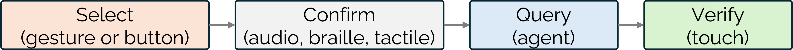

Data visualizations are part of everyday life, from business to news to education, but they remain largely out of reach for people who are blind or have low vision (BLV). Refreshable tactile displays (RTDs) render graphics as raised pins that can change on demand, which makes them far more interactive than printed tactile graphics. On their own, though, RTDs are low resolution, which limits labelling, and tactile graphics are hard to interpret without a description.

This project pairs an RTD with a conversational agent. The agent provides verbal context and analytical support, while the chart on the display gives spatial grounding and independent tactile access to the data.

## Learning how people would use it

We began with a Wizard-of-Oz study in which 11 BLV participants explored line charts, bar charts and isarithmic maps using an RTD and a conversational agent. We identified nine distinct interaction patterns. The choice of modality depended on the task and on prior experience with tactile graphics, and participants strongly preferred touch and speech together over either one alone. Participants with more tactile experience described how tactile images supported deeper engagement with the data and independent interpretation. This work received a Best Paper Honorable Mention at IEEE VIS 2024.

## Building the architecture

Next we built Feelogue, an open-source reference architecture and the first system to combine touch input with a conversational agent on an RTD. It supports deictic queries that fuse what you're touching with what you say, such as "what is the trend between these points?" It handles touch sensing on the display, rendering Vega-Lite charts as tactile pin grids, grounding the conversation in touch context, and synchronising tactile, braille and audio output. This work received a Best Paper Award (VisNotes track) at IEEE PacificVis 2026.

## Co-designing Graphy

Over four workshops across eight months, we worked with three blind co-designers to refine Graphy, an LLM-powered conversational tactile data interface. Co-designers used touch as their main way of understanding the shape of the data, its trends and relationships. They turned to the agent for what touch couldn't resolve, like calculation and analysis, and used the chart on the display to check the agent's answers. Key outcomes include:

- a **layered presentation** that introduces chart components one at a time, so exploration builds up progressively
- a **feedback grammar** that distinguishes tactile feedback started by the user from feedback started by the agent
- a sequential interaction pattern, **select, confirm, ask, verify**, where each step grounds the last

*The interaction flow in Graphy: touch is at the centre, and from it users navigate layers, select data points, query the agent or filter series.*

*The select, confirm, ask, verify interaction pattern.*

This work received a Best Paper Honorable Mention and will appear at IEEE VIS 2026.
